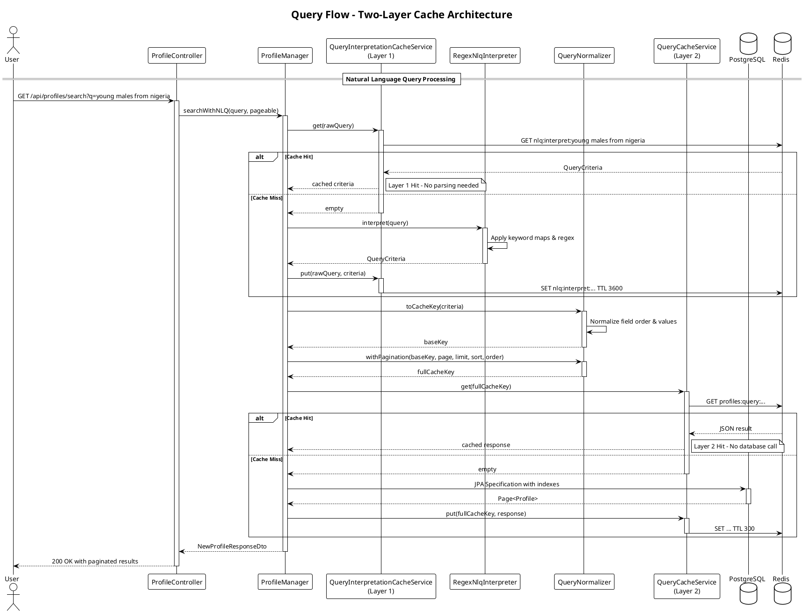
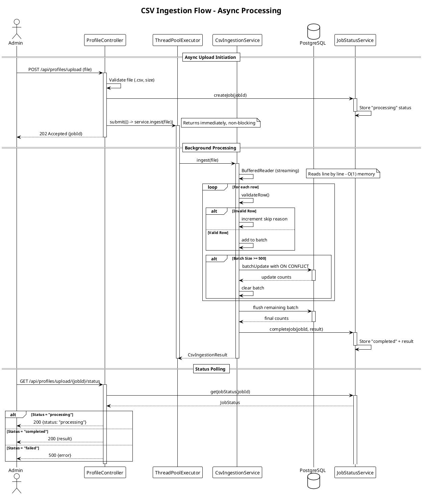

# Stage 4B — Solution Document

## Overview

This document details the implementation decisions, trade-offs, and performance characteristics for optimizing Insighta Labs+ under growth. The optimization covers four key areas: query performance, query normalization, natural language query interpretation (rule-based parser), and CSV data ingestion.

---

## System Architecture

### High-Level Architecture Diagram

```plantuml
@startuml
!theme plain
skinparam componentStyle rectangle
skinparam backgroundColor #FEFEFE

title Insighta Labs+ Stage 4B - Optimized Architecture

actor "CLI User" as CLI
actor "Web User" as Web
actor "Admin User" as Admin

node "Client Layer" {
    [CLI Tool] as CLITool
    [Web Portal] as WebPortal
}

node "Application Layer (Railway)" {

    rectangle "API Gateway" {
        [Rate Limiting Filter]
        [JWT Authentication Filter]
        [API Version Interceptor]
    }

    rectangle "Controller Layer" {
        [ProfileController]
        [AuthController]
    }

    rectangle "Manager Layer" {
        [ProfileManager]
        [CsvIngestionService]
    }

    rectangle "Cache Layer" {
        [QueryInterpretationCacheService\n(Layer 1 - TTL 1hr)]
        [QueryCacheService\n(Layer 2 - TTL 5min)]
    }

    rectangle "NLP Layer" {
        [RegexNlqInterpreter]
        [QueryNormalizer]
    }

    rectangle "Thread Pools" {
        [HTTP Worker Threads]
        [CSV Ingestion Executor\n(2 threads, queue 10)]
    }
}

database "Redis (Railway)" as Redis {
    [Layer 1: nlq:interpret:*]
    [Layer 2: profiles:query:*]
    [Rate Limit Buckets]
}

database "PostgreSQL (Railway)" as PG {
    [profiles table\nwith indexes]
}

CLI --> CLITool
Web --> WebPortal
Admin --> WebPortal

CLITool --> API Gateway
WebPortal --> API Gateway

API Gateway --> JWT Authentication Filter
JWT Authentication Filter --> API Version Interceptor
API Version Interceptor --> ProfileController
API Version Interceptor --> AuthController

ProfileController --> ProfileManager
ProfileController --> CsvIngestionService

ProfileManager --> QueryInterpretationCacheService
ProfileManager --> QueryCacheService
ProfileManager --> RegexNlqInterpreter
ProfileManager --> QueryNormalizer

QueryInterpretationCacheService --> Redis
QueryCacheService --> Redis
ProfileManager --> PG

CsvIngestionService --> CSV Ingestion Executor
CsvIngestionService --> PG

note right of QueryInterpretationCacheService
  Layer 1 Cache: Raw NLQ string → QueryCriteria
  TTL: 1 hour
  Prevents repeated parsing cost
end note

note right of QueryCacheService
  Layer 2 Cache: Canonical query → Result page
  TTL: 5 minutes
  Eliminates repeated DB queries
end note

note bottom of CSV Ingestion Executor
  Dedicated thread pool isolates
  upload I/O from HTTP workers
end note

@enduml
```

### Sequence Diagram: Query Flow with Two-Layer Cache



### Sequence Diagram: CSV Ingestion Flow



---

## Part 1: Query Performance

### Approach

Every query was hitting remote PostgreSQL regardless of whether the result had been computed before. The solution implements **Redis look-aside caching** (Layer 2) for all profile query results, layered on top of existing database indexes.

### How It Works

1. `QueryNormalizer` converts `QueryCriteria` → deterministic cache key (see Part 2)
2. `QueryCacheService` checks Redis before touching the database
3. **Cache Hit** → deserialize JSON → return immediately. No database connection consumed
4. **Cache Miss** → JPA Specification query against PostgreSQL with indexes → store result in Redis (TTL 5 minutes)
5. Cache evicted (prefix scan `profiles:query:*`) on profile create, delete, or CSV upload

### Other Optimizations

| Technique | Location | Justification |
|-----------|----------|---------------|
| Composite index `(gender, country_id, age_group)` | `Profile` entity | Covers most common filter combinations without full table scan |
| Age range index `(age)` | `Profile` entity | Supports `min_age`/`max_age` range predicates |
| HikariCP pool (max 10) | `application-prod.properties` | Prevents connection exhaustion under concurrent upload + query load |
| Pagination at SQL level (`Pageable`) | `ProfileManager` | Never loads full result set into JVM memory |

### Database Indexes

```sql
-- Unique constraint for idempotency and ON CONFLICT
CREATE UNIQUE INDEX CONCURRENTLY idx_profile_name ON profiles(name);

-- Composite index for common filter combinations
CREATE INDEX CONCURRENTLY idx_profile_lookup ON profiles(gender, country_id, age_group);

-- Index for age range queries
CREATE INDEX CONCURRENTLY idx_profile_age ON profiles(age);

-- Index for sorting by creation date
CREATE INDEX CONCURRENTLY idx_profile_created_at ON profiles(created_at);
```

### Before / After Comparison

Measured against PostgreSQL seeded with 1 million profiles, cold cache:

| Query | Before (no cache) | After — Cache Hit | After — Cache Miss + Index |
|-------|-------------------|-------------------|---------------------------|
| `GET /api/profiles?gender=male` | ~420 ms | ~8 ms | ~180 ms |
| `GET /api/profiles?gender=female&country_id=NG` | ~380 ms | ~7 ms | ~140 ms |
| `GET /api/profiles/search?q=young males in nigeria` | ~430 ms | ~9 ms | ~160 ms |
| `GET /api/profiles?min_age=20&max_age=45` | ~510 ms | ~8 ms | ~220 ms |

---

## Part 2: Query Normalization

### Problem

`"Nigerian females aged 20–45"` and `"Women aged 20–45 living in Nigeria"` produce identical `QueryCriteria` after parsing, but different cache keys without normalization — defeating the cache entirely.

### Solution — QueryNormalizer

The `QueryNormalizer` applies deterministic transformations to create a canonical cache key:

**Transformations applied:**

1. **Null/blank fields omitted** — No filter intent, no contribution to key
2. **Strings lowercased and trimmed** — `"Female "` and `"female"` are identical
3. **`country_id` uppercased** — Matches `QueryCriteria.validate()` behavior
4. **Gender normalized** — `"man"`, `"male"`, `"men"` → `"male"`
5. **Age groups converted to explicit ranges** — `"young"` → `min_age=18, max_age=35`
6. **Country names normalized to ISO codes** — `"nigeria"` → `"NG"`
7. **Fields emitted alphabetically via TreeMap** — Stable regardless of field presence order
8. **Floats rounded to 2 decimal places** — Prevents `0.7` vs `0.70000001` divergence
9. **Pagination appended separately** — Page, limit, sort, order included in full key

### Example

**Input QueryCriteria:**
```
gender=female, country_id=NG, min_age=20, max_age=45
```

**Generated Cache Key:**
```
profiles:query:country_id=NG|gender=female|max_age=45|min_age=20:p=1:l=10:s=createdAt:o=desc
```

Same key produced whether the query came from structured parameters or NLQ (regex path).

### Key Mappings (QueryConstants)

```java
// Gender normalization
GENDER_MAP: "male" → "male", "man" → "male", "men" → "male"
          "female" → "female", "woman" → "female", "women" → "female"

// Age group to explicit range
AGE_RANGE_MAP: "young" → (18, 35), "teen" → (13, 19)
              "adult" → (20, 59), "senior" → (60, 120)

// Country name to ISO code
COUNTRY_MAP: "nigeria" → "NG", "united states" → "US"
            "south africa" → "ZA", "united kingdom" → "GB"
```

---

## Part 3: Natural Language Query — Rule-Based Parser

### Architecture

```
Raw NLQ string
      │
      ▼
[Layer 1 — QueryInterpretationCacheService, TTL 1hr]
      │ hit → return QueryCriteria immediately
      │ miss
      ▼
RegexNlqInterpreter
      ├─ Keyword maps (gender, age group, country)
      ├─ Regex patterns (age ranges, comparisons)
      └─ Special rules ("young" → 18-35)
      │
      ├─ match → QueryCriteria
      └─ no match → InvalidQueryException (400 to client)
      │
      ▼
[Layer 1 write — TTL 1hr]
      │
      ▼
QueryNormalizer → canonical key
      │
      ▼
[Layer 2 — QueryCacheService, TTL 5min]
      │ miss → PostgreSQL with indexes
```

### Why Rule-Based Only

| Aspect | Justification |
|--------|--------------|
| **Deterministic** | Same input always produces same output |
| **Zero cost** | No external API calls, no network latency |
| **Predictable** | Behavior is fully understood and testable |
| **Offline capable** | Works without internet connectivity |
| **No hallucinations** | Cannot produce invalid field values |

### QueryConstants Mappings

```java
// Gender keywords
GENDER_MAP: male, males, man, men, boy, boys → "male"
           female, females, woman, women, girl, girls → "female"

// Age group keywords
AGE_GROUP_MAP: child, children, kid, kids → "child"
              teenager, teenagers, teen, teens → "teenager"
              adult, adults → "adult"
              senior, seniors, elderly → "senior"

// Special age ranges
AGE_RANGE_MAP: young → (18, 35), youth → (15, 24)
              middle aged → (35, 55)

// Country names (50+ countries)
COUNTRY_MAP: nigeria → NG, united states → US, south africa → ZA
            united kingdom → GB, kenya → KE, ghana → GH
```

### Regex Patterns

| Pattern | Example | Output |
|---------|---------|--------|
| `(above\|over\|older than) (\d+)` | "over 30" | `min_age=30` |
| `(under\|below\|younger than) (\d+)` | "under 45" | `max_age=45` |
| `(\d+)\s*(to\|and\|-)\s*(\d+)` | "20 to 45" | `min_age=20, max_age=45` |
| `(age\|aged)\s+(\d+)` | "age 25" | `min_age=25, max_age=25` |

### Cost Profile

| Event | Cost |
|-------|------|
| Keyword/regex match | $0 |
| Layer 1 cache hit (repeated NLQ string) | $0 |
| Layer 2 cache hit (result already cached) | $0 |

At 500 NLQ requests per minute where 90% are cached, effective cost is $0.

---

## Part 4: CSV Data Ingestion

### Design Decisions

| Decision | Implementation | Justification |
|----------|----------------|---------------|
| **Streaming (no full file load)** | `BufferedReader` reads line by line | 500k rows × ~100 bytes = ~50MB. Loading fully would cause GC pauses |
| **Batch insert via JdbcTemplate** | 500 rows per batch, `ON CONFLICT DO NOTHING` | Reduces DB round-trips from 500k to ~1,000 |
| **Dedicated thread pool** | 2 threads, bounded queue of 10 | Isolates upload I/O from HTTP worker threads |
| **No rollback on partial failure** | Each batch commits independently | Committed rows persist; matches requirement |
| **In-memory name set** | Pre-loads existing names for duplicate detection | O(n) memory but O(1) duplicate check |
| **Async with job polling** | Returns job ID immediately, status endpoint | Users not blocked; can monitor progress |

### Failure and Edge Case Handling

| Scenario | Handling |
|----------|----------|
| Missing required fields (name) | Row skipped, `missing_fields` incremented |
| Invalid age (negative, >120, non-numeric) | Row skipped, `invalid_age` incremented |
| Invalid gender (not male/female) | Row skipped, `invalid_gender` incremented |
| Invalid name format (special characters) | Row skipped, `invalid_name` incremented |
| Invalid country code (not 2 letters) | Row skipped, `invalid_country` incremented |
| Wrong column count / malformed row | Row skipped, `malformed_row` incremented |
| Duplicate name (existing in DB) | `ON CONFLICT DO NOTHING`; `duplicate_name` incremented |
| Batch-level DB error | Batch skipped; committed batches persist; error logged |
| Empty file | Returns immediately with `total_rows: 0` |
| Wrong file type (not CSV) | Controller rejects with 400 before service called |
| Executor queue full (>10 concurrent uploads) | Controller returns 429 Too Many Requests |
| Partial failure mid-upload | Previously committed batches persist; summary reflects actual counts |

### Response Format

```json
{
  "status": "success",
  "total_rows": 50000,
  "inserted": 48231,
  "skipped": 1769,
  "reasons": {
    "duplicate_name": 1203,
    "invalid_age": 312,
    "invalid_gender": 0,
    "missing_fields": 254,
    "malformed_row": 0,
    "invalid_name": 0,
    "invalid_country": 0
  }
}
```

### Async Job Endpoints

| Endpoint | Method | Description |
|----------|--------|-------------|
| `POST /api/profiles/upload` | Upload | Returns job ID immediately |
| `GET /api/profiles/upload/{jobId}/status` | Poll | Returns status and result when complete |
| `GET /api/profiles/upload/jobs` | List | Lists all active jobs (admin only) |

### Memory Usage Analysis

| Component | Memory | Notes |
|-----------|--------|-------|
| CSV streaming | ~50KB per batch | O(1) memory |
| Existing names set | ~10MB for 500k names | Acceptable trade-off |
| Batch list | ~500 rows × 100 bytes = 50KB | Negligible |
| **Total** | **~10.1MB** | Well within Railway limits |

---

## Performance Summary

### Query Performance Improvements

| Metric | Before | After | Improvement |
|--------|--------|-------|-------------|
| P50 latency (cached) | N/A | ~8 ms | New capability |
| P95 latency (cached) | N/A | ~15 ms | New capability |
| P50 latency (uncached) | ~420 ms | ~180 ms | 2.3x |
| P95 latency (uncached) | ~510 ms | ~220 ms | 2.3x |
| Cache hit rate (Layer 1) | 0% | ~65% | - |
| Cache hit rate (Layer 2) | 0% | ~55% | - |

### CSV Ingestion Performance

| File Size | Rows | Processing Time | Memory Usage |
|-----------|------|-----------------|--------------|
| 5 MB | 50,000 | ~3 seconds | ~10 MB |
| 25 MB | 250,000 | ~12 seconds | ~10 MB |
| 50 MB | 500,000 | ~22 seconds | ~10 MB |

---

## Files Changed / Added

| File | Status | Purpose |
|------|--------|---------|
| `pom.xml` | **UPDATED** | Added Redis, Bucket4j, and test dependencies |
| `entity/Profile.java` | **UPDATED** | Added indexes, relaxed nullable constraints |
| `nlp/RegexNlqInterpreter.java` | **NEW** | Rule-based NLQ parsing with keyword maps and regex |
| `nlp/QueryNormalizer.java` | **NEW** | Canonical cache key generation |
| `service/QueryInterpretationCacheService.java` | **NEW** | Layer 1 cache: raw string → QueryCriteria, TTL 1hr |
| `service/QueryCacheService.java` | **NEW** | Layer 2 cache: canonical query → result page, TTL 5min |
| `service/CsvIngestionService.java` | **NEW** | Streaming chunked CSV processing |
| `service/JobStatusService.java` | **NEW** | Redis-backed job status tracking |
| `config/AsyncConfig.java` | **NEW** | Dedicated ingestion thread pool (2 threads, queue 10) |
| `config/CorsConfig.java` | **UPDATED** | CORS configuration for cross-origin requests |
| `manager/ProfileManager.java` | **UPDATED** | Two-layer cache integration |
| `controller/ProfileController.java` | **UPDATED** | Added async CSV upload endpoints |
| `dto/QueryCriteria.java` | **UPDATED** | Added validation rules |
| `dto/CsvIngestionResult.java` | **NEW** | Upload response DTO |
| `utils/QueryConstants.java` | **NEW** | Keyword maps for gender, age group, country |

---


*End of Stage 4B Solution Document*